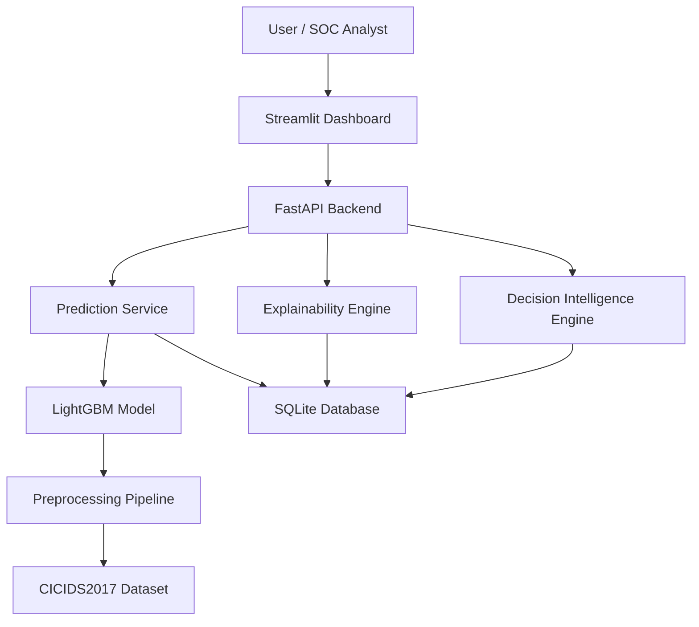
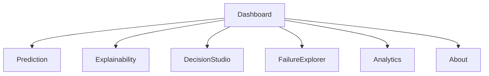

# ARCHITECTURE.md

# SentinelXAI Software Architecture

Version: 1.0

Project:
SentinelXAI – Explainable AI Decision Intelligence Platform

---

# Purpose

This document describes the complete software architecture of SentinelXAI.

It covers

- Overall System Architecture
- Module Architecture
- ML Pipeline
- Backend Architecture
- Dashboard Architecture
- API Flow
- Database Design
- Deployment Architecture
- Folder Structure
- Responsibilities

This architecture follows modular design principles and is intended to support future scalability.

---

# High-Level Architecture



---

# Layered Architecture

```
Presentation Layer

↓

Application Layer

↓

Machine Learning Layer

↓

Data Layer
```

---

# Layer Responsibilities

## Presentation Layer

Technology

Streamlit

Responsibilities

Dashboard

Prediction

Analytics

Explainability

Decision Studio

Failure Explorer

---

## Application Layer

Technology

FastAPI

Responsibilities

REST API

Authentication (future)

Validation

Logging

Database Access

Routing

---

## Machine Learning Layer

Responsibilities

Preprocessing

Training

Inference

Evaluation

Explainability

Confidence

Recommendation Engine

---

## Data Layer

Responsibilities

Raw Dataset

Processed Dataset

Model Files

Logs

SQLite Database

Configuration Files

---

# Component Architecture

```mermaid
flowchart LR

User

↓

Dashboard

↓

API

↓

Prediction Engine

↓

LightGBM

↓

Prediction

↓

SHAP

↓

Recommendation

↓

Database
```

---

# Source Structure

```
src/

preprocessing/

training/

evaluation/

explainability/

decision_engine/

api/

dashboard/

database/

utils/

configs/
```

---

# Module Responsibilities

## preprocessing/

Purpose

Data Cleaning

Files

loader.py

cleaner.py

validator.py

splitter.py

Responsibilities

Read CSV

Merge Files

Remove Duplicates

Handle Missing Values

Train/Test Split

---

## training/

Purpose

Model Training

Files

baseline.py

lightgbm_model.py

trainer.py

optimize.py

Responsibilities

Train models

Benchmark

Save model

---

## evaluation/

Purpose

Model Evaluation

Files

metrics.py

confusion.py

roc.py

benchmark.py

Responsibilities

Metrics

Plots

Benchmark tables

---

## explainability/

Purpose

Explain predictions

Files

shap_engine.py

plots.py

templates.py

Responsibilities

SHAP

Waterfall

Summary

Human explanation

---

## decision_engine/

Purpose

Decision support

Files

confidence.py

recommendation.py

risk.py

priority.py

Responsibilities

Confidence

Risk

Recommendations

Priority

---

## api/

Purpose

REST API

Files

main.py

routes.py

schemas.py

services.py

Responsibilities

Prediction

Validation

Response

Logging

---

## dashboard/

Purpose

User Interface

Files

app.py

pages/

components/

Responsibilities

Visualization

Prediction

Analytics

Interaction

---

## database/

Purpose

Database access

Files

db.py

models.py

crud.py

Responsibilities

Store predictions

Store logs

Metadata

---

## utils/

Purpose

Reusable functions

Examples

logger.py

constants.py

helpers.py

config.py

---

# Machine Learning Pipeline

```mermaid
flowchart LR

RawCSV

↓

Cleaning

↓

Validation

↓

Split

↓

Baseline

↓

LightGBM

↓

Evaluation

↓

SHAP

↓

SaveModel
```

---

# Prediction Pipeline

```mermaid
flowchart LR

CSV

↓

Preprocessing

↓

LightGBM

↓

Prediction

↓

Confidence

↓

SHAP

↓

Recommendation

↓

API Response
```

---

# Explainability Pipeline

```mermaid
flowchart LR

Prediction

↓

TreeSHAP

↓

Feature Contributions

↓

Human Explanation

↓

Dashboard
```

---

# Dashboard Architecture

Pages

Dashboard

Prediction

Explainability

Decision Studio

Failure Explorer

Analytics

About

---

# Dashboard Navigation



---

# Backend Architecture

```mermaid
flowchart TD

Request

↓

Validation

↓

Prediction Service

↓

Decision Engine

↓

Response
```

---

# API Workflow

Client

↓

POST /predict

↓

Validation

↓

Preprocessing

↓

Inference

↓

SHAP

↓

Recommendation

↓

JSON Response

---

# Database Design

SQLite

Tables

prediction_history

model_metadata

logs

system_metrics

future

users

feedback

---

# Prediction Record

Prediction ID

Timestamp

Attack

Confidence

Severity

Top Features

Latency

User

---

# Configuration

configs/

config.yaml

logging.yaml

model.yaml

Never hardcode configuration.

---

# Logging Architecture

Application

↓

Rotating File Handler

↓

logs/

application.log

training.log

prediction.log

error.log

---

# Deployment Architecture

```mermaid
flowchart LR

Docker

↓

FastAPI

↓

LightGBM

↓

SQLite

↓

Streamlit
```

---

# Security

Validate uploads

Validate schema

Limit upload size

Catch exceptions

Never expose stack traces

---

# Performance Targets

Inference

<100 ms

API

<200 ms

Dashboard

Responsive

Model

<10 MB

---

# Scalability

Future

Cloud

Kubernetes

Redis

PostgreSQL

RabbitMQ

SIEM Integration

Streaming Data

---

# Engineering Principles

One module

One responsibility

Never duplicate code.

Always isolate business logic.

Never place ML code inside the UI.

Never place preprocessing inside API routes.

Never mix database logic with prediction logic.

Keep every layer independent.

---

# Definition of Architecture Success

✔ Modular

✔ Testable

✔ Reusable

✔ Explainable

✔ Scalable

✔ Production Ready